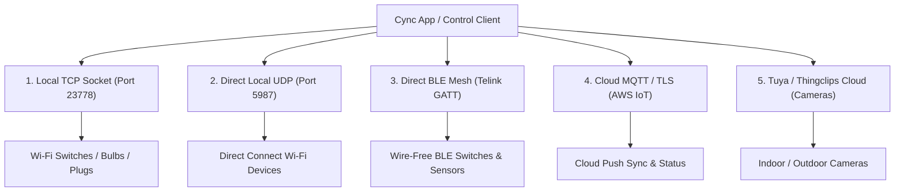
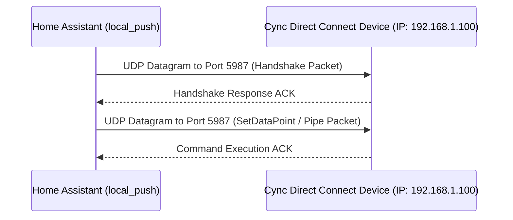

# Control Pathways and Application Transport Protocols

This document details the alternative control pathways, transport mechanisms, and local communication channels supported across the Cync hardware ecosystem.

---

## 1. Complete App Transport Matrix (5 Protocols)

The decompiled Cync Android app (`cync_decompiled_v2`) implements 5 distinct transport channels:

### Transport Comparison Table

| Protocol Transport Channel | Port / Interface | Target Devices | HA Core Compatibility | IoT Class | Configuration Requirement |
| :--- | :--- | :--- | :--- | :--- | :--- |
| **1. Direct Local UDP** | UDP `5987` (`XlinkProperty.DEVICE_PORT`) | Direct Connect Wi-Fi Bulbs, Plugs, Switches | **Native / Core Ready** | `local_push` | Zero-config DHCP discovery (`88:50:F6` / `00:24:E4`) |
| **2. Local TCP Interception** | TCP `23778` (`cm.gecbyge.com`) | Wi-Fi Switches, Bulbs, Plugs | Advanced Option | `local_push` | DNS Redirection / Router Host Override |
| **3. Direct BLE Mesh** | Bluetooth GATT (`TLSR8258`) | C-Life/C-Sleep Bulbs, Wire-Free Switches | Separate Integration (`cync_ble`) | `local_push` | BlueZ / HA Bluetooth Adapter |
| **4. Cloud MQTT / AWS TLS** | TCP `8883` (`mqtt.gecbyge.com`) | All Account Devices | Cloud Standard | `cloud_push` | Cync Account Credentials |
| **5. Tuya / Thingclips** | HTTPS / P2P Stream | Indoor & Outdoor Cameras | Disqualified | `cloud_push` | Tuya P2P SDK |

---

## 2. Direct Local UDP Control (Port 5987)

### Mechanics
Direct Local UDP operates over port `5987` using `io.xlink.wifi.sdk.udp.UdpSendPacket` (`sendHandShake`, `sendPipe`, `sendSetDataPoint`, `sendPing`).

### Advantages for Home Assistant Core Submission
1. **Zero DNS Redirection**: Does NOT require DNS server overrides (`cm.gecbyge.com`).
2. **100% UI Config Flow**: Onboards automatically via native Home Assistant DHCP discovery matching MAC prefixes `88:50:F6` and `00:24:E4`.
